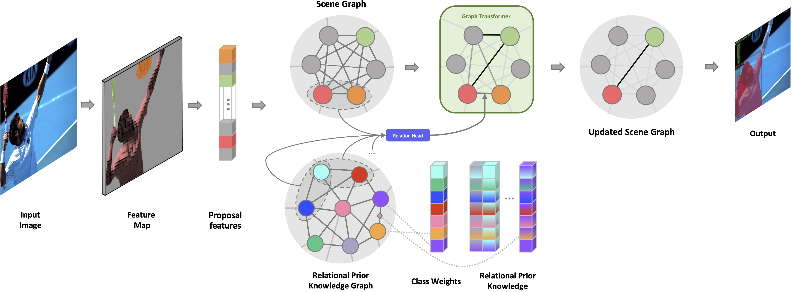

# RP-FEM: Relational Prior Knowledge Graphs for Detection and Instance Segmentation
This repository contains the code of the paper [Relational Prior Knowledge Graphs for Detection and Instance Segmentation](https://arxiv.org/abs/2310.07573) by Osman Ülger, Yu Wang, Ysbrand Galama, Sezer Karaoglu, Theo Gevers and Martin R. Oswald in ICCV2023 SG2RL Workshop.

<p align="center">
  
</p>

## Code Release
- [x] Notebooks for Relational Prior Knowledge Graph (RPKG) generation
- [ ] Relation Head
- [ ] Context Update
- [ ] Full model

## Cite
```
@InProceedings{Ulger_2023_ICCV,
    author    = {\"Ulger, Osman and Wang, Yu and Galama, Ysbrand and Karaoglu, Sezer and Gevers, Theo and Oswald, Martin R.},
    title     = {Relational Prior Knowledge Graphs for Detection and Instance Segmentation},
    booktitle = {Proceedings of the IEEE/CVF International Conference on Computer Vision (ICCV) Workshops},
    month     = {October},
    year      = {2023},
    pages     = {53-61}
}
```